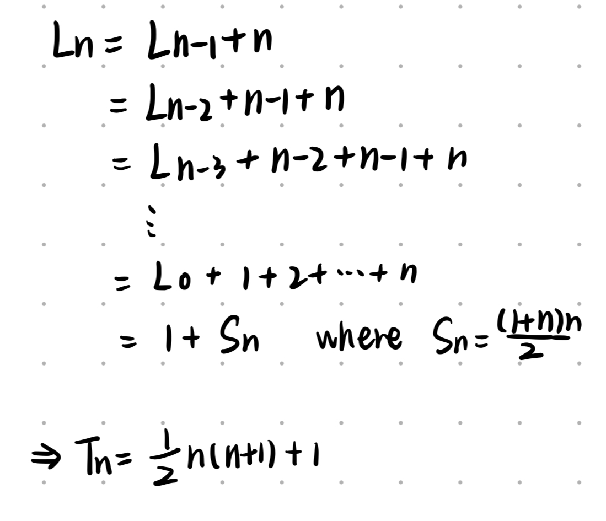

# Recurrent Problems

There are 3 sample problems of recurrent

* The Tower of Hanoi
* Lines in the Plane
* The Josephus Problem

Components:

1. base case: $a_0$
2. recurrence function

## The Tower of Hanoi

$T_n$: the minimum number of moves that will transfer $n$ disks from one peg to another Lucas's rules.

$T_0=0$: no moves at all are needed to transfer a

tower of n = 0 disks

$T_1=1$

$T_2=3$

To transfer $n$ disks in general, we first transfer $n-1$ smallest to a different peg (requiring $T_{n−1}$​ moves), then move the largest (requiring one move), and fnally transfer the $n−1$ smallest back onto the largest (requiring another Tn−1 moves).
$$
T_n = 2T_{n-1}+1
$$
Then, we can write this equalities as
$$
\begin{cases}
  & T_0=0 \\
  & T_n = 2T_{n-1}+1, \text{for }n>0
\end{cases}
$$
This is called a **recurrence**.

So how do we solve a recurrence?

### Solving a recurrence

Method 1: **Mathematical induction** =  basis + induction

Method 2: simplied $T_n$


## **Lines in the Plane**

What is the maximum number Ln of regions defined by n lines in the plane?


The recurrence is therefore
$$
\begin{cases}
  & L_0=1 \\
  & L_n = L_{n-1}+n, \text{for }n>0
\end{cases}
$$


And now a variation of the lines-in-the-plane problem: Suppose that instead of straight lines we use bent lines, each containing one "zig." What is the maximum number $Z_n$ of regions determined by n such bent lines in the plane?


$$
Z_n=L_{2n}-2n=2n^2-n+1
$$

## The Josephus Problem

In our variation, we start with n people numbered 1 to n around a circle, and we eliminate every $m$ remaining person until only one survives.

> 这个题很有意思，先思考一下再看下面的分析

$m=1$: die in order

$m=2, n=10$: 


The elimination order is 2, 4, 6, 8, 10, 3, 7, 1, 9, so 5 survives. The problem: Determine the survivor's number, $J(n)$.

|     $n$      |  1   |  2   |  3   |  4   |  5   |  6   |
| :----------: | :--: | :--: | :--: | :--: | :--: | :--: |
| $J(n)_{m=2}$ |  1   |  1   |  3   |  1   |  3   |  5   |

1. $J(n)_{m=2}$ seems only  to be odd
2. 每一轮杀人都会杀死一半且向下取整
3. 幸存的人重新编号
4. if n is odd
   1. 1 will die
5. if n is even
   1. 1 will survive after 1 cycle

### **如何回溯？**

先在$n=10$的情况下举例子

步骤：

1. 去掉所有双数的
2. 若当前总数为偶数，则1存活，若当前为奇数，杀掉1
3. 重新编号活下来的部分
4. 循环1，直到总数只剩1人

（注：“-” 代表当前循环死亡的人）

| cycles |  1   |  2   |  3   |  4   |  5   |  6   |  7   |  8   |  9   |  10  |
| :----: | :--: | :--: | :--: | :--: | :--: | :--: | :--: | :--: | :--: | :--: |
|   1    |  1   |  -   |  3   |  -   |  5   |  -   |  7   |  -   |  9   |  -   |
|        |  1   |      |  2   |      |  3   |      |  4   |      |  5   |      |
|   2    |  -   |      |  -   |      |  3   |      |  -   |      |  5   |      |
|        |      |      |      |      |  1   |      |      |      |  2   |      |
|   3    |      |      |      |      |  1   |      |      |      |  -   |      |

如何找剩下的这个人原始编号是谁，把这个问题转换成如何找到每个编号前一个循环的编号是谁，因此我们要从后往前回溯，用新编号表示旧编号。

#### 先找出每一次循环的人数关系

每一次幸存下来的数字的个数$k$都是原来的个数除以2再向下取整得来的，因此，原来的人数只有可能是$2k$或者$2k+1$

至此，我们可以画出以下图像，其中，每个节点的数字代表有多少个数字存活：


不难发现这是一个二叉树，且每一个正整数都会出现在节点上，那么说明当$n$是任意一个正整数时都有唯一的路径能到达节点1，而节点1所对应的原来的编号就是最终答案。

#### 如何从节点1的编号回溯呢？

节点1意味着只剩下一个幸存的数字了，那么这个数字新的编号一定是1，根据上面表格的规律我们知道，上一层幸存的编号一定得是奇数。

根据$J(n)$的那个表格我们可以得出幸存的节点在长度为2和3时编号分别为1和3，以此类推可以得出下面的图：


由此可以写出递推公式：
$$
\begin{cases}
  & N_{even}=2i-1 \\
  & N_{odd}=2i+1
\end{cases}
$$
其中$i$为当前层答案的编号

若用$N(n)$来表示节点$n$的编号，那么式子可以写成：
$$
\begin{cases}
  & N(2n)=2N(n)-1 \\
  & N(2n+1)=2N(n)+1
\end{cases}
$$
代码实现：

```java
public static int J(int n) {
    if (n < 1) return 0;
    if (n == 1) return 1;
    int t = n / 2;
    if (n % 2 == 0) return 2 * J(t) - 1;
    return 2 * J(t) + 1;
}
```

```python
def J(n):
    if n < 1:
        return 0
    if n == 1:
        return 1
    t = int(n / 2)
    if n % 2 == 0:
        return 2 * J(t) - 1
    return 2 * J(t) + 1
```

Time Complexity: $O(\log{n})$

### Interesting finding

If we list some result and group them, as follow: 


It seems we can group by powers of 2.  $J(n)$ is always 1 at the beginning of a group and it increases by 2 within a group.

let $n=2^m+l$​,  where $2^m$ is the largest power of 2 not exceeding $n$ and where $l$​ is what's left. The solution to our recurrence seems to be
$$
J(2^m+l)=2l+1, \text{for }m\ge 0\text{ and }0\le l <2^m
$$
Binary version
$$
n=(1b_{m-1}b_{m-2}...b_{0})\\
l=(0b_{m-1}b_{m-2}...b_{0})\\
2l=(b_{m-1}b_{m-2}...b_{0}0)\\
2l+1=(b_{m-1}b_{m-2}...b_{0}1)
$$
Example:
$$
J(1101)=1011\\
J(1101)=1011\\
J(1011)=0111\\
J(0111)=J(111)=111
$$
